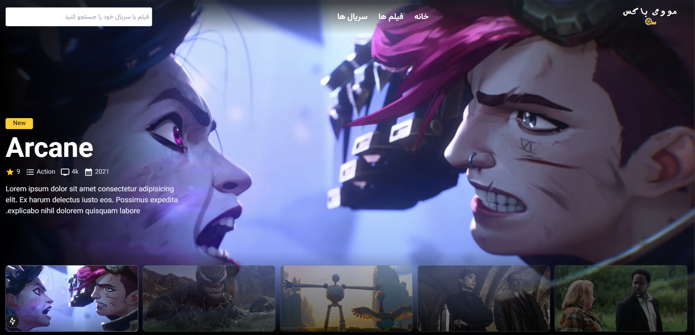

# About The Project

BoxOfMovies is a comprehensive platform for watching and discovering the latest movies and TV shows. The goal of this platform is to provide a simple and user-friendly experience for movie and TV enthusiasts. Users can easily access information about movies and TV shows, ratings, and summaries, and easily find the movies or TV shows they are looking for.

## Built With

The technology that I used in making this project:

## Getting Started

This is an example of how you may give instructions on setting up your project locally. To get a local copy up and running follow these simple example steps.

### Prerequisites

This is an example of how to list things you need to use the software and how to install them.

`npm install npm@latest -g`

### Installation

_Below is an example of how you can instruct your audience on installing and setting up your app. This template doesn't rely on any external dependencies or services._

**1.Get a free API Key at** https://developer.themoviedb.org/docs/getting-started

**2.Clone the repo**

`git clone https://github.com/ProfessorMR/box-of-movies.git`

**3.Install NPM packages**

`npm i`

**4.Enter your ACCESS_TOKEN in services/index.js**

`const ACCESS_TOKEN = 'ENTER YOUR API';`

## Contact

Mohammad Ramaji: [instagram](https://instagram.com/mohammad._.rmj)
Project Link: [BoxOfMovies](https://github.com/ProfessorMR/box-of-movies.git)

## Acknowledgments

I would like to give credit to the original UI design that inspired this project:

- **[LeeuCode](https://github.com/LeeuCode/)** - Original UI design concept  
- [Original Design on templatemonster](https://www.templatemonster.com/website-templates/gammra-movies-amp-tv-series-bootstrap-template-436098.html)

Thank you for your amazing design and inspiration!
